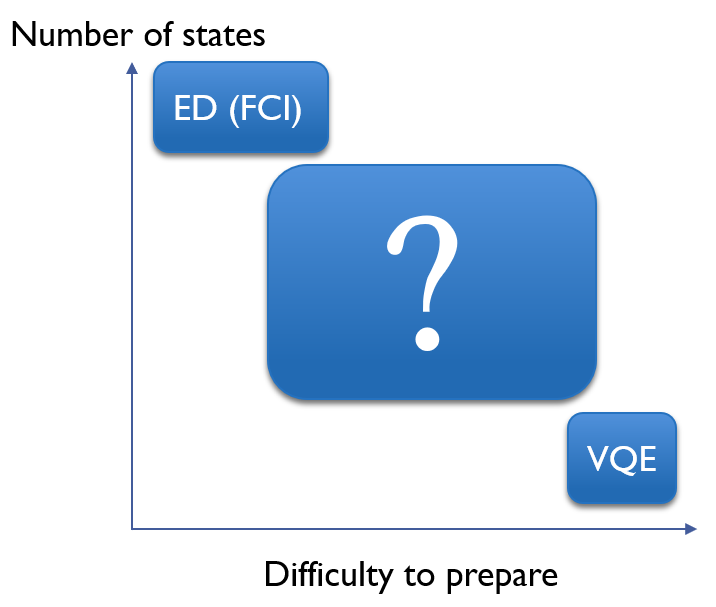

# Mizore


Mizore is an open source effort for providing a *programmer-efficient, *highly-modularized* and *high-performance* software platform for *near-term* quantum algorithm developing. Currently, Mizore focus on solving the ground state energy problem with affordable resources requirement for near-term devices. There are three main modules in Mizore.

- [Quantum Subspace Expansion](src/QuantumSubspaceExpansion.ipynb)
- [Adaptive Circuit Construction](src/AdaptiveCircuitConstruction.ipynb)
- [Correlation Network Analysis](src/CorrelationNetwork.ipynb)


## Basic ideas

Different from most of the software platform for quantum  computing, Mizore aims to provide a programmer-efficient programming framework to decrease the difficulty for developers from all fields to learn and carry out research on near-term quantum algorithms. Here we present how to start a easiest VQE run by Mizore.

```python
from Blocks import BlockCircuit,HardwareEfficientEntangler
from ParameterOptimizer import BasinhoppingOptimizer
from HamiltonianGenerator.TestHamiltonian import make_example_H2
# Generate the Objective of optimization
energy_obj=make_example_H2()
# Construct the parameterized circuit
bc=BlockCircuit(4)
bc.add_block(HardwareEfficientEntangler([0,2]))
# Carry out the optimization
energy,amp=BasinhoppingOptimizer(random_initial=0.1).run_optimization(bc,energy_obj.get_cost())
print(energy) #Output: -1.1372838344885012
```

Mizore provides intrinsic support to parameterized circuit by `Block` and `BlockCircuit`. The users can easily produce highly flexible parameterized quantum circuit with Mizore. We believe that a detailed introduction note is vital for interdisciplinary researchers. One can start learning Mizore by our interactive notes [BasicConcepts](src/BasicConcept.ipynb).

## The Picture

What does the first industrial application of quantum computing look like?  This question has been thought by generations of quantum computing theorists and many progresses have been made in this field. From Shor's algorithm to Variational Quantum Eigensolver (VQE), people proposed more and more near-term applicable algorithm. However, even though progresses are continually made in quantum devices manufacturing, no one can estimate when VQE can have quantum supremacy use.

One the other hand, besides VQE, there are also other quantum algorithms proposed, in which the Quantum Subspace Diagonalization (QSD) is of special importance. Different from, VQE, in QSD people do not directly produce the ground state of the Hamiltonian on the quantum devices. Instead, people are required to find and run quantum circuits which can produces a set of quantum states that span a subspace. A diagonalization is carried out in the subspace and the ground state can be found if it has a large overlap with the subspace. Here we want to point out that

- Exact Diagonalization (ED) can be seen as a QSD algorithm in the subspace spanned by the computational basis;

- VQE can be seen as a QSD algorithm in the subspace spanned by only one quantum state.

  Based on the above observation, as illustrated in the figure, we want to point out that

- The basis states used in ED can be produced even without a quantum computer because they are all classical;

- The basis states used in VQE can be seen, in some sense, as the most difficult state to prepare in this ground state problem, because by holding them the problem is already solved.

Is it possible that there is a intermediate algorithm between ED and VQE? Based on this question, the developers of Mizore conjecture these should exist a QSD-based quantum algorithm with

- Intermediate number of basis states needed (Unlike ED, which needs exponentially many);
- Intermediate difficulty of state preparation (Unlike VQE, which produce the most difficult state);
- Good convergence property towards chemical accuracy.

However, this kind of algorithm is still unknown. But it is no wonder that this kind of algorithm is extremely important for near-term quantum computing. Especially, we want to underscore here that this type of quantum algorithms

- May provide immediate speed-up with respect to ED calculation though quantum supremacy is not achieved;

- May require much less quantum resources, including the number of qubits and number of gates, to achieve same accuracy.

To facilitate the designing and test of such quantum algorithm, we designed Mizore, in which

- includes module `CircuitConstructor` for adaptively generating circuits for achieving same objective with much fewer quantum gates;
- includes module `SubspaceSolver` for QSD, with support to QSD with sparse-correlated basis states.;
- includes module `Precalculation` and`Network` for classical pre-calculation and analyze the correlation (entanglement) network of the objective wavefunction.

These modules are highly modularized and can be combined with each other easily. We will add more modules that we think is important for near-term quantum algorithm in the future.

## Plans and Future

Here we propose several questions that we think is important and want to solve with the aid of the Mizore framework.

- How to construct a variational ansatz adaptively for the propose of Quantum Variational Simulation ([QVS](https://quantum-journal.org/papers/q-2019-10-07-191/));
- How to construct a set of sparse-correlated state (not full entangled and so can be decomposed) as the basis state for QSD;
- How to construct the operator pool for various construction objective;
- How to incorporate machine learning techniques to help circuit construction.


## Setup
It is very simple to download Mizore in your computer.

```shell
# clone mizore into your local computer
git clone https://github.com/doomspec/Mizore.git
```
Here, we list the package required by Mizore. 
```shell
multiprocess,numpy,scipy,matplotlib # Commonly used
HiQ,projectq # Quantum Simulation
pyscf # Chemical backend
openfermion, openfermionpyscf (HiQ Fermion) # Fermion Encoding and Operator operations
networkx # Network Processing
infomap # Community detection
minorminer # Graph Embedding
dmrgpy # Classical Pre-calculation (Manual install required)
```

Notice: Mizore does not support Windows now because PySCF is used for Hamiltonian generating.


## Authors
Zi-Jian Zhang (张子健), Jia-Qi Hu (胡家祺) and Yi Liu (刘艺) from Southern University of Science and Technology (SUSTech, Shenzhen, China). The authors are the members of the Man-Hong Yung group.

## The meaning of Mizore
Mizore is a Japanese word which writes 霙 in Kanji (Chinese Character). 霙  reads *ying* in Chinese and has the same meaning as mizore. Mizore means sleet in English. The parameters in parameterized quantum circuits are like water because they can be adjusted continuously and the blocks in the circuit are like ice because they have fixed shape. In a adaptive circuit construction, the blocks and parameters in the circuit are both optimized. Therefore, it is like sleet which contains both water and ice.
